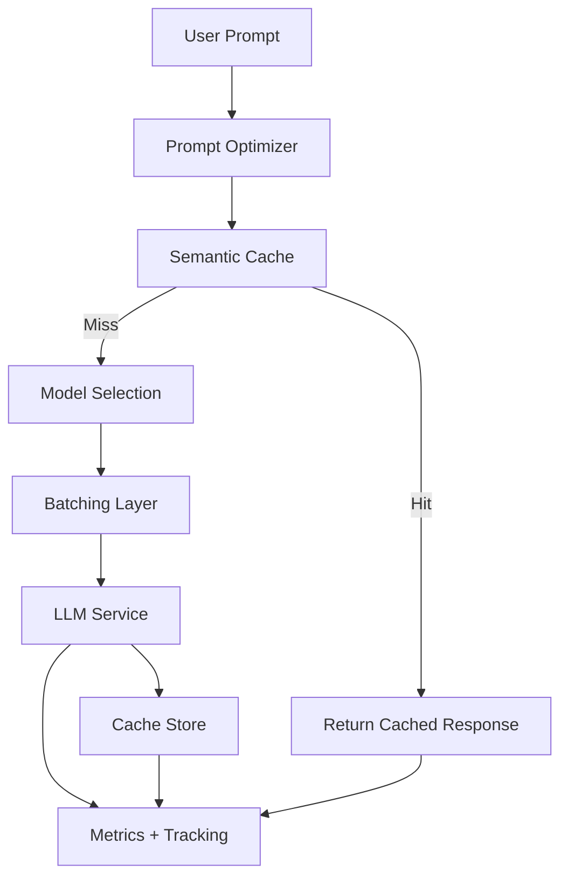

# Integrated LLM Cost Optimizer

## Problem Statement Number: 3.5

### Cost and Resource Optimization for LLM Agents

Objective: Develop a system to optimize costs and resource usage for LLM agents.

---

## System Architecture (Theory)

The system is designed as a multi-stage pipeline that reduces cost and latency while preserving response quality. Each stage adds a specific optimization layer, and the pipeline composes them in a deterministic order.

1) Prompt optimization
	- Cleans and shortens the prompt to reduce token usage.
	- Analyzes intent, complexity, expected output length, and latency tolerance.
	- The goal is to reduce input cost while preserving semantics.

2) Semantic cache
	- Uses vector similarity search (FAISS) to detect prior responses to semantically similar prompts.
	- If a cache hit occurs, the system skips the LLM call and returns a cached response.
	- This is the largest cost saver in repeated or similar-query workloads.

3) Model selection
	- Chooses a cost-optimal model based on intent, complexity, and latency tolerance.
	- The system prefers cheaper models unless the request requires higher capability.

4) Batching
	- Groups requests by model within a short time window to improve throughput.
	- Adaptive batching adjusts wait time and batch size based on latency tolerance.

5) LLM execution
	- Executes the selected model (real or simulated), tracks tokens, latency, and cost.

6) Cache store and tracking
	- Stores successful responses in cache based on a value-based policy.
	- Tracks per-query and aggregate metrics for cost, latency, and cache hit rate.

This design optimizes cost by first minimizing inputs (prompt optimization), then avoiding model calls (cache), and finally choosing the cheapest suitable model for any remaining call. Batching reduces per-request overhead, and tracking enables continuous tuning of thresholds.

---

## System Architecture Diagram



---

## Setup and Run

Run the complete pipeline from integrated-cost-optimizer.

1) Open terminal in workspace root:
```bash
cd path-to/accion-labs
```

2) Move to the module:
```bash
cd integrated-cost-optimizer
```

3) Create and activate virtual environment:
```bash
python -m venv venv
source venv/bin/activate
```

4) Install dependencies:
```bash
pip install -r requirements.txt
```

5) Configure environment:
```bash
cp .env.example .env
```
Update .env as needed:
- SIMULATE_LLM=true and SIMULATE_EMBEDDINGS=true for no-cost simulation runs
- or set GEMINI_API_KEY and disable simulation for real API runs

6) Start backend:
```bash
uvicorn main:app --reload --port 8000
```

7) Start dashboard (new terminal):
```bash
cd integrated-cost-optimizer
source venv/bin/activate
streamlit run streamlit_app.py
```

8) Open in browser:
- API: http://localhost:8000/docs
- Dashboard: http://localhost:8501

---

## Configuration

Key settings in .env:
- GEMINI_API_KEY
- SIMULATE_LLM (true or false)
- SIMULATE_EMBEDDINGS (true or false)
- MAX_CACHE_SIZE
- OPTIMIZATION_INTERVAL

---

## Project Structure (integrated-cost-optimizer)

```
integrated-cost-optimizer/
  main.py               # FastAPI backend
  streamlit_app.py      # Dashboard
  config.py             # Configuration
  models.py             # Data models
  demo.py               # Load test demo
  demo2.py              # Alternate demo
  prompt_optimizer/     # Cleaning, shortening, analysis, token counting
  cache/                # FAISS-based semantic cache and eviction policy
  batching/             # Model selection and batching policy
  llm/                  # LLM service (real or simulated)
  pipeline/             # Orchestrator and query tracker
```

---

## API Endpoints

- POST /query
- GET /metrics
- GET /recent-queries
- GET /cache/stats
- GET /cache/entries
- GET /cache/evictions
- POST /cache/clear
- GET /batching/stats
- GET /config
- POST /clear-all